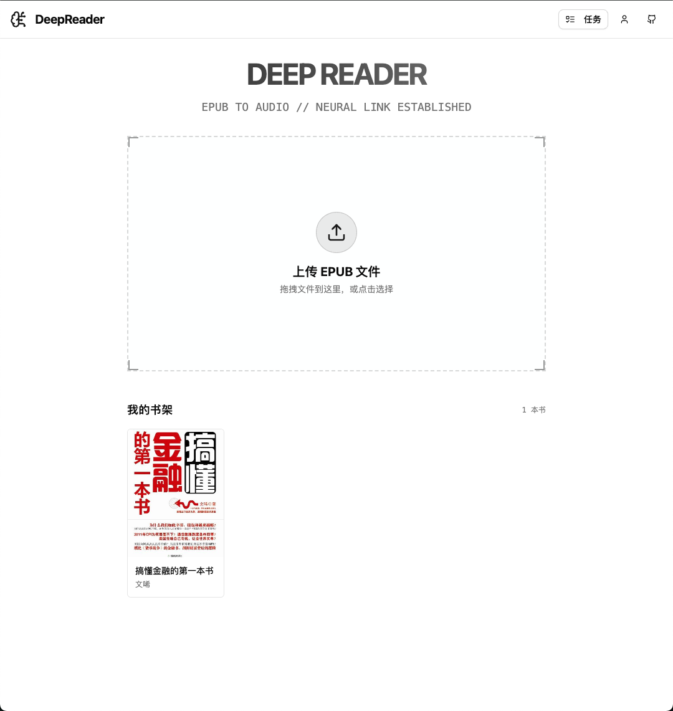
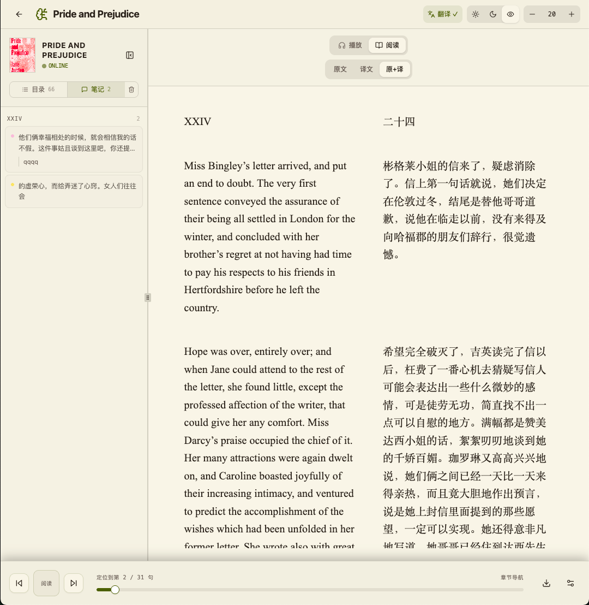
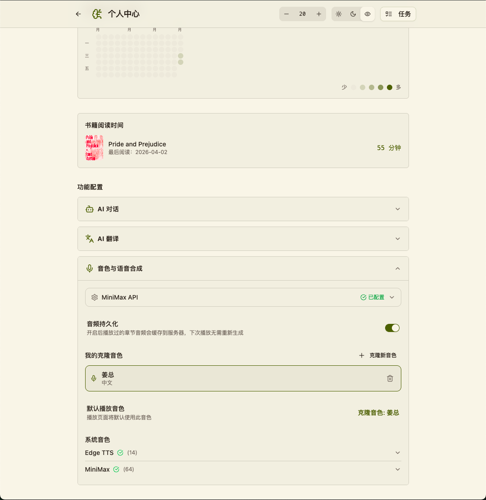
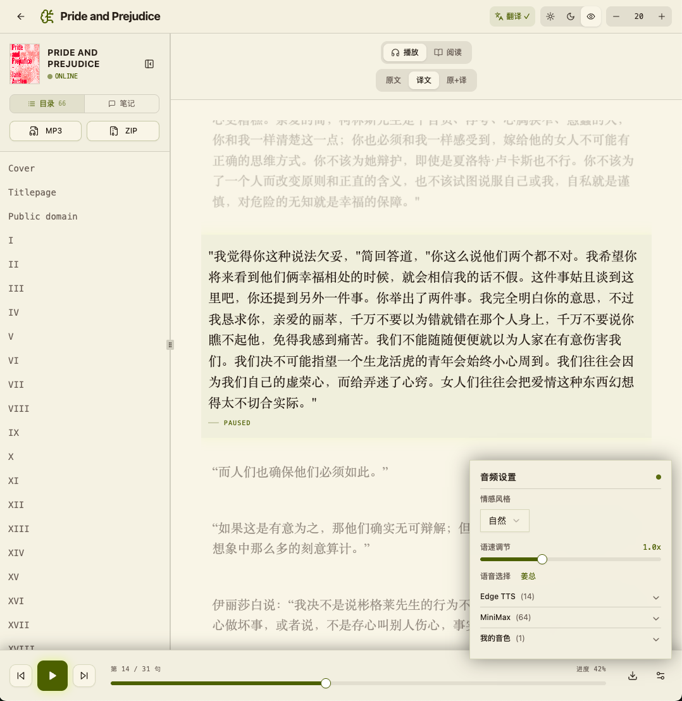
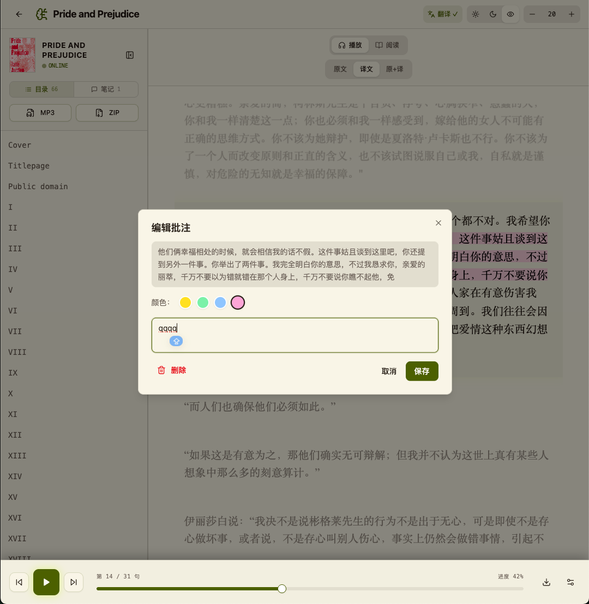
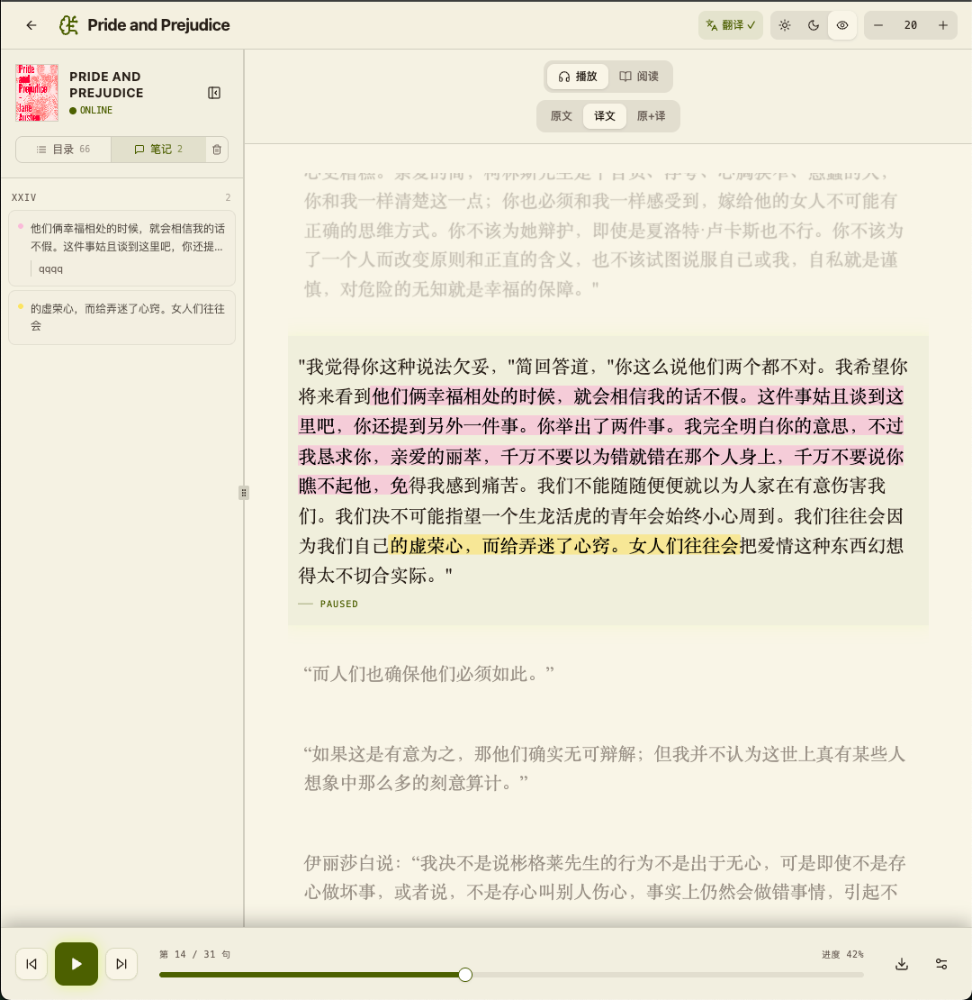
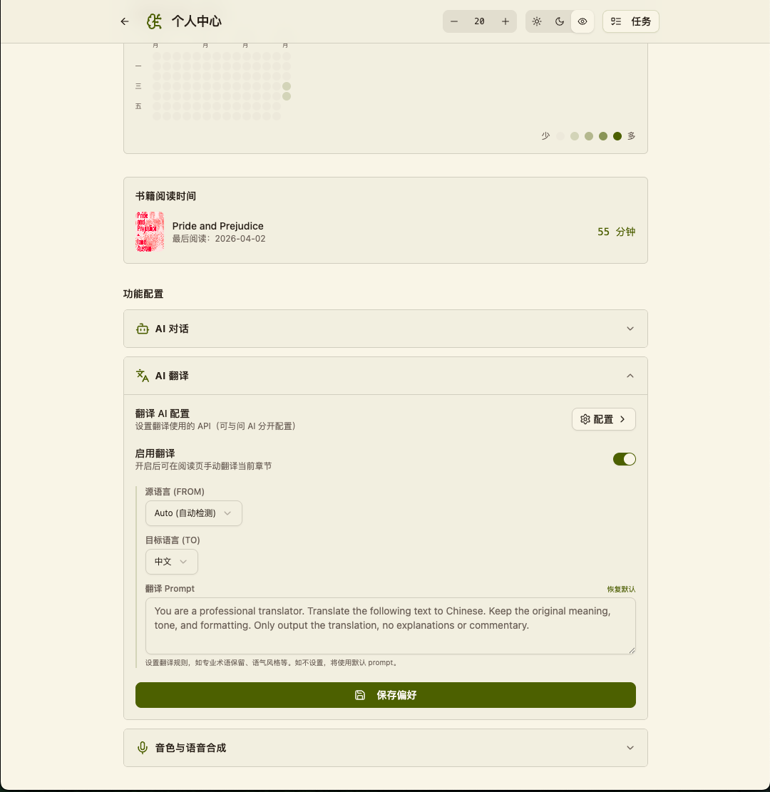
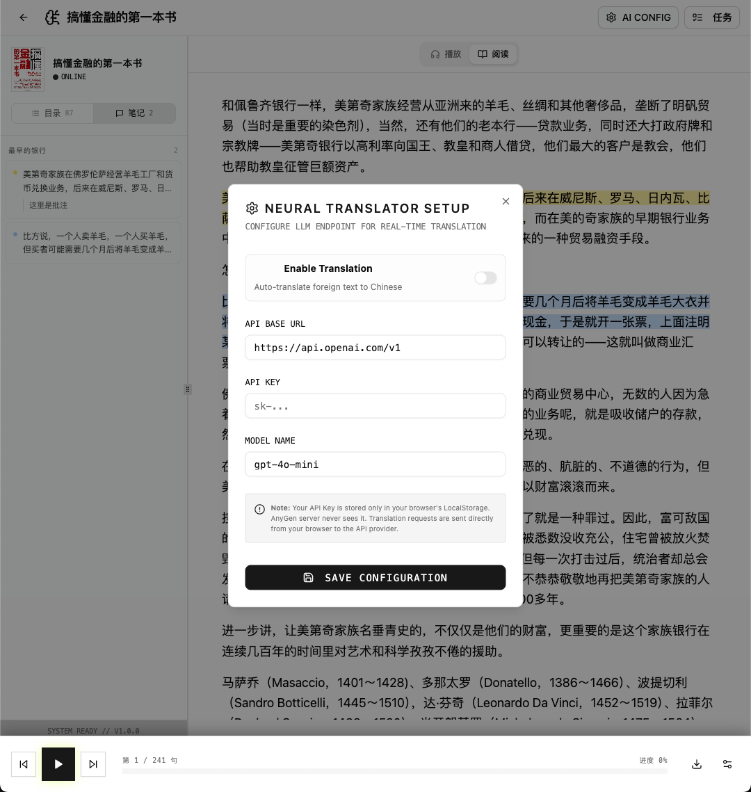
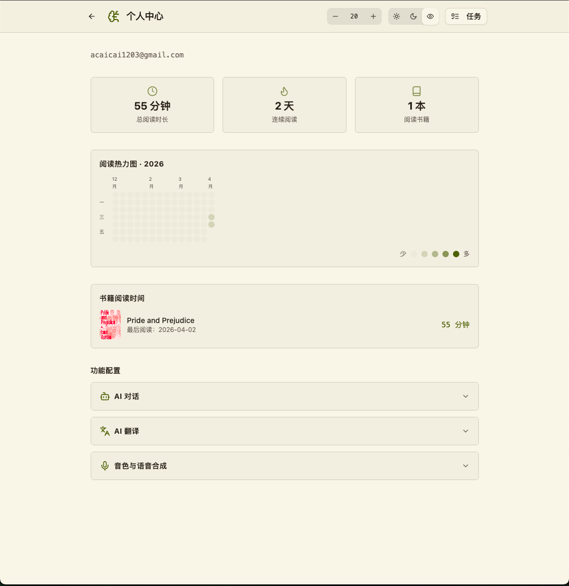

# BookReader

一款轻量级 EPUB 阅读器 Web 应用，支持文字阅读与 AI 语音朗读

**在线体验：https://deepkb.com.cn**

[](https://github.com/LydiaCai1203/BookReader)


---

## 功能与优势

| 功能 | 说明 |
|------|------|
| **阅读** | EPUB 解析、章节导航、进度追踪、书籍自动保存 |
| **双语阅读** | 中英文对照、沉浸式阅读体验 |
| **语音朗读** | Edge TTS 免费语音、14+ 音色可选、实时高亮、音频缓存、离线下载 |
| **音色克隆** | 自定义声音模型，打造专属朗读音色 |
| **高亮跟读** | 边听边读，同步高亮对照 |
| **批注笔记** | 文本高亮、多色批注、批注列表统一管理 |
| **AI 翻译** | 选中内容即时翻译 |
| **AI 助手** | 选中内容提问、AI 智能解答 |
| **个人中心** | 阅读数据统计、热力图、习惯分析 |
| **多端同步** | PostgreSQL 数据持久化，随时继续阅读 |

---

## 技术栈

### 后端
- Python 3.10+ / FastAPI / edge-tts / ebooklib / SQLAlchemy / PostgreSQL

### 前端
- React 18 / TypeScript / Vite / TailwindCSS / shadcn/ui / TanStack Query / epubjs

---

## 界面预览

### 阅读体验

| 页面 | 说明 |
|------|------|
|  | 首页 - 书架与阅读入口 |
|  | 双语阅读 - 中英文对照沉浸式体验 |

### 语音朗读

| 页面 | 说明 |
|------|------|
|  | 音色克隆 - 自定义专属声音 |
|  | 高亮跟读 - 边听边读同步高亮 |

### 批注管理

| 页面 | 说明 |
|------|------|
|  | 多色批注 - 彩色标记重点内容 |
|  | 批注列表 - 统一管理所有笔记 |

### AI 智能

| 页面 | 说明 |
|------|------|
|  | AI 翻译 - 选中内容即时翻译 |
|  | 问 AI - 智能解答阅读疑问 |

### 个人中心

| 页面 | 说明 |
|------|------|
|  | 个人中心 - 阅读数据与统计 |

---

## 快速部署

### 环境要求

- Docker & Docker Compose

### 启动服务

```bash
# 克隆项目后，进入项目目录
cd /workspace

# 启动所有服务（数据库 + 后端 + 前端 + Nginx）
docker-compose up -d

# 查看服务状态
docker-compose ps
```

### 访问应用

- Nginx 代理端口：**80**
- 访问地址：`http://localhost`

### 服务架构

| 服务 | 端口 | 说明 |
|------|------|------|
| nginx | 80, 443 | 反向代理 |
| frontend | 80 (nginx) | React 前端 |
| backend | 8000 (internal) | FastAPI 后端 |
| db | 5432 (internal) | PostgreSQL 数据库 |

### 停止服务

```bash
docker-compose down
```

### 重新构建

```bash
docker-compose up -d --build
```

---

## 项目结构

```
/workspace/
├── assets/                    # README 图片资源
├── epub-tts-backend/          # 后端服务
│   ├── app/
│   │   ├── main.py            # 应用入口
│   │   ├── api.py             # API 路由
│   │   ├── routers/           # 路由模块
│   │   ├── services/          # 业务逻辑
│   │   └── models/            # 数据模型
│   └── data/                  # 数据存储
│       ├── books/             # EPUB 文件
│       ├── audio/             # 音频缓存
│       └── images/            # 用户图片
├── epub-tts-frontend/         # 前端应用
│   └── src/
│       ├── components/        # UI 组件
│       ├── pages/             # 页面
│       └── api/               # API 服务
├── docker-compose.yml         # 容器编排
└── nginx/                     # Nginx 配置
```

---

## Star History

<a href="https://www.star-history.com/?repos=LydiaCai1203%2FBookReader&type=timeline&legend=top-left">
 <picture>
   <source media="(prefers-color-scheme: dark)" srcset="https://api.star-history.com/image?repos=LydiaCai1203/BookReader&type=timeline&theme=dark&legend=top-left" />
   <source media="(prefers-color-scheme: light)" srcset="https://api.star-history.com/image?repos=LydiaCai1203/BookReader&type=timeline&legend=top-left" />
   
 </picture>
</a>

---

## License

**禁止商业使用**

本项目仅供个人学习与研究使用，未经授权不得用于任何商业目的。

MIT License
